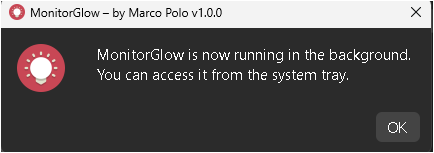
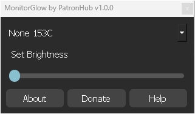
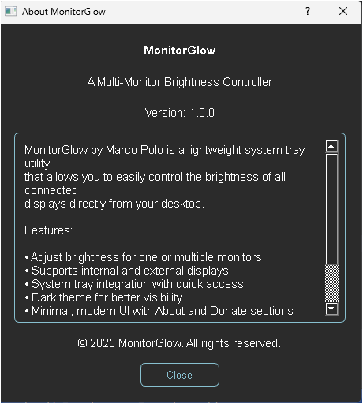
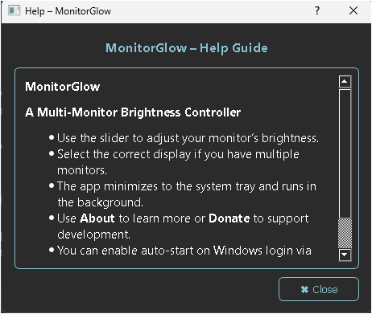
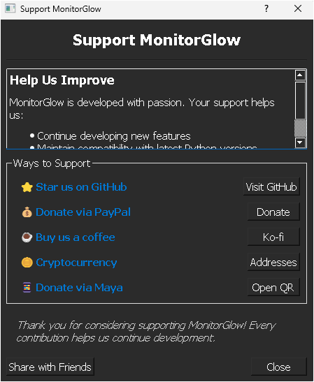

# MonitorGlow

 


**MonitorGlow** – Multi-Monitor Brightness Controller  
Developed by **Marco Polo | PatronHub**  

---

## 📂 Project Structure

MonitorGlow/
│
├─ main.py                 # Entry point to run the application
├─ monitor_glow.py         # Main UI and core application logic
├─ README.md               # Project documentation and usage guide
├─ LICENSE                 # MIT License file
├─ requirements.txt        # Python dependencies
│
├─ config/                 # Application configuration settings
│   ├─ __init__.py
│   └─ app_config.py       # Constants like APP_NAME, VERSION, links, etc.
│
├─ core/                   # Backend utilities and helpers
│   ├─ __init__.py
│   ├─ crypto_utils.py     # Encryption/decryption for secure QR donations
│   ├─ monitor.py          # Monitor detection and brightness control logic
│   └─ utils.py            # Helper functions (notifications, registry, etc.)
│   
├─ dialogs/                # Modular PyQt5 dialog windows
│   ├─ __init__.py
│   ├─ About_Dialog.py     # About dialog window
│   ├─ Donate_Dialog.py    # Donation dialog window
│   └─ Help_Dialog.py      # Help/usage instructions dialog
│   
├─ assets/                 # Project resources and media
│   └─ screenshots/        # UI preview screenshots for documentation
│       ├─ welcome_ui.png
│       ├─ main_ui.png
│       ├─ about_ui.png
│       ├─ donate_ui.png
│       └─ help_ui.png
│   
├─ resources_rc.py         # Compiled Qt resource file (.qrc)
└─ .env                    # Environment variables (API keys, secrets, etc.)


---

## ⚡ Features

* Control brightness for one or multiple monitors  
* Supports internal and external displays  
* System tray integration with quick access  
* Dark theme for better visibility  
* Minimal, modern UI with **About**, **Help**, and **Donate** dialogs  
* Offline operation — no internet required  
* Modular, maintainable PyQt5 codebase  
* Optional QR code donation system (Maya, PayPal, Ko-fi, Crypto)  

---

## 🖼 Screenshots

**Welcome Interface:**



**Main Brightness Controller:**



**About Dialog:**



**Help Dialog:**



**Donate Dialog:**



---

## 🚀 Installation

1. Clone the repository:

```
git clone https://github.com/j3fcruz/MonitorGlow.git
cd MonitorGlow
```

2. Create a virtual environment (recommended):

```
python -m venv venv
source venv/bin/activate  # Linux/Mac
venv\Scripts\activate     # Windows
```

3. Install dependencies:

```
pip install -r requirements.txt
```

4. Run the application:

```
python main.py
```

---

## 📝 Usage

- Launch the app; it appears in the **system tray**.  
- Click the tray icon to open the **brightness controller**.  
- Use the slider to adjust your monitor’s brightness.  
- Access **About**, **Help**, or **Donate** dialogs for info and support.  
- Auto-start on Windows login can be enabled via settings.  

---

## ⚙ Dependencies

```
PyQt5>=5.15.7
screen_brightness_control>=1.2.0
cryptography>=41.0.0
qrcode>=7.4.2
```

Install via pip:

```
pip install -r requirements.txt
```

---

## 🧠 Modules Overview

| Module                  | Description                                                       |
| ----------------------- | ----------------------------------------------------------------- |
| **monitor_glow.py**     | Main application logic and system tray integration                |
| **dialogs/**            | Separate dialogs for About, Help, and Donate                       |
| **core/crypto_utils.py**| Handles encryption/decryption for secure QR donations             |
| **resources_rc.py**     | Compiled Qt resources (.qrc) including icons and QR files         |
| **main.py**             | Initializes the application window                                 |

---

## 🎨 Themes

- Dark theme (default) for better night visibility  
- Optional light theme can be added via QSS  

---

## 🛠 Contributing

1. Fork the repository.  
2. Create a new branch: `git checkout -b feature/YourFeature`.  
3. Make your changes.  
4. Commit: `git commit -m 'Add YourFeature'`.  
5. Push: `git push origin feature/YourFeature`.  
6. Submit a Pull Request.  

> Follow PEP8 style and modular PyQt5 practices.

---

## 📜 License

**MonitorGlow** is licensed under the **MIT License**. See the LICENSE file for details.  
© 2025 Marco Polo | PatronHub. All rights reserved.  

---

## 👤 Author

**Marco Polo | PatronHub**  

GitHub: [@j3fcruz](https://github.com/j3fcruz)  
Ko-fi: [@marcopolo55681](https://ko-fi.com/marcopolo55681)

💰 PayPal: [@jecfcruz](https://paypal.me/jofreydelacruz13)  
🪙 Crypto: BTC 1BcWJT8gBdZSPwS8UY39X9u4Afu1nZSzqk,ETH xcd5eef32ff4854e4cefa13cb308b727433505bf4
---

## 🔑 Notes

* Works offline and does not require internet to adjust brightness.  
* QR donation system supports Maya, PayPal, Ko-fi, and cryptocurrency.  
* Compatible with multiple monitors and external displays.  
* Brightness control relies on `screen_brightness_control` — ensure proper permissions.
